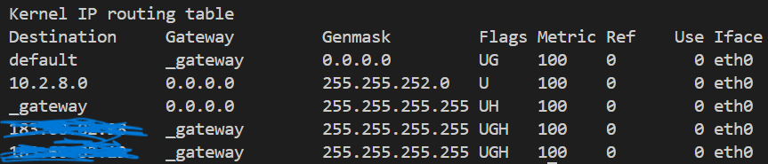

# 网络层协议——IP协议

——本文参考 游双 《Linux高性能服务器编程》

本篇文章要点：

- IPv4头部结构
- IP分片
- IP路由
- IP转发
- 重定向

## IPv4头部结构

IPv4通TCP报头类似，同样具有固定的报头长度（20字节）和可变的选项（最多40字节），其具体构成如图：

- 4位版本号（version）：指定IP协议版本，目前主流的IP协议版本为IPv4，其值为4。对于其他的IP协议版本（IPv6等），有不同的值，其头部构造也与IPv4不同；
- 4位头部长度：用于标识IP报头的长度（不包括数据部分），因为有固定IP报头长度的存在，其取值范围为[20, 60]（字节）；
- 8位服务类型（Type of Service，TOS）：// TODO
- 16位总长度（Total Length）：指整个IP报文的长度，以字节为单位，所以IP数据报的理论长度为65535（2 ^ 16 - 1）字节。但是由于MTU（Maximum Transmission Unit）的限制，导致长度超过MTU限制的都将进行分片传输（关于分片，之后会重点介绍）；
- 16位标识（Identification）：用于唯一的标识主机发送的IP数据报文。其初始值有系统随机生成；每发送一个IP数据报，其值就递增1。该值在发生分片时会复制到每个分片中，因此每个分片具有相同的标识值，这是判断分片的重要标识之一；
- 3位标志：第一位保留（即暂时并未使用），第二位（Don't Fragment，DF）表示**禁止分片**，该标志位一旦设置，分片行为将被禁止，当IP数据报文长度大于MTU时，IP报文直接被丢弃；第三位（More Fragment，MF）表示**更多分片**，除了数据报的最后一个分片外，其他分片都需要将该标志设为1；
- 13位分片偏移（Fragment Offset）：分片相对原始IP数据报开始处（仅指数据部分）的偏移，在分片一节会重点介绍；
- 8位生存时间（Time to Live，TTL）：为了避免发生路由循环问题（会导致资源大量浪费，网络拥塞问题）而设置的路由器跳数限制，注意这里的生存时间并不是指的真实时间，而是路由器的跳数；
- 8位协议（Protocol）：用来区分上层协议，主要用于IP的分用过程；
- 16位头部校验和（Header Checksum）：与TCP类似，采用CRC算法检查IP头部；
- 32位源端和目的端IP地址：类似于TCP协议，只不过TCP是端口号，这里是IP地址，不予介绍；

## IP分片

主要介绍几个问题：

- 分片的细节问题；
- 分片的识别；
- 分片的组装（分片的次序问题）；
- 分片的缺点；

首先，我们要意识到：分片是一个迫不得已的策略，只是为了满足底层（数据链路层的Mac帧协议）的有限传输大小而采取的对策，其不会带来任何的传输效率上的优化，相反的，它会导致更多的丢包和数据传输问题；

_分片的细节_

这里举个例子来说明分片中的细节问题：比如我要传递一个2980字节的数据（其中已经包括了TCP头部等信息），假设我们不带任何选项，只有IP头部的固定20字节，此时我们一共需要传递3000字节的数据；

但是由于以太网的MTU只有1500字节，所以我们需要采取分片传输策略，我们先将1500字节的数据作为第一个分片，此时我们还剩下`3000 - 1500 = 1500`字节的数据需要传输；

这时有人会想，1500字节直接再作为一个分片传递，一共只需要两个报文即可完成数据的传递，但是这样吗？注意，每个分片都必须带有IP报头，因为**每个分片都是一个独立传输的报文**，理解了这个，就知道了上述的直接传递是不可取的；

所以我们要先添加IP报头20字节，再传递1480字节的有效数据，最后剩下的20字节再和20字节的IP报头组合，作为第三个分片进行传递；

> 图中以1501字节为例

_分片的识别_

分片的识别前文已经提到一些，这里做一个总结：

> - 共用一个16位标识值的必然属于同一个分片
> - 3位标志位第三位为1 且 13位片偏移为0 的必然是分片组的第一个分片

_分片的组装_

IP分片的组装首先依赖于上面的识别，接收端的IP层将属于同一分片的IP报文归在一起，随后通过它们的13位片偏移量进行排序，将非头部的IP报文的有效载荷提取，报头丢弃，最后完成拼接工作。

_分片的缺点_

介绍完分片的组装后，随之而来的问题是——如果其中一个报文在传输过程中丢失，是将丢失的报文传递还是需要将整个IP报文都传过去呢？注意，IP的分片是只有IP层负责的，也就是说，其上层（TCP层）和下层（MAC帧）都是不关心是否分片的，无论是IP的分片报文，还是一个普通报文，都是将其视为一个普通的报文进行传递的——所以一旦存在IP分片报文丢失，TCP并不清楚哪个分片丢失（它甚至不知道什么是IP分片），重传的时候也就只会将整个IP报文一起重传了；

而这就会导致重传的概率大大增加，因为每个分片报文都可能发生丢包，而一旦丢包，就是整个IP报文一起重传，而频繁的分片操作也会带来较大的性能开销等问题；

## IP路由

再介绍一下IP路由相关问题，分为三个小节介绍：

- IP模块工作流程
- 路由机制
- 路由表更新

_IP模块的工作流程_

我们以箭头顺序来看IP模块的工作流程：

首先IP层接收到来自数据链路层的IP报文，并对头部选项进行处理，判断是否为发送到本机的IP，如果是，则交由上层协议处理；如果不是，则进行数据转发，通过IP路由机制和IP层的传输协议处理，传递IP报文；

关于这里的**源站选路**，可以理解成源主机指定的数据传输的路径列表，列出沿途经过的每个路由器的地址，而不是根据路由器中的路由表进行跳转；

### 优缺点：

- **优点**：
  - **灵活性**：源站可以根据应用需求灵活选择路径。
  - **网络控制**：应用可以更好地控制数据流，优化网络性能。
- **缺点**：
  - **复杂性**：需要源主机了解网络的结构和状态。
  - **安全性问题**：恶意用户可能利用源站选路进行网络攻击，如伪造路径等。

_路由机制_

在谈路由机制之前，我们需要了解一个概念——路由表；

> 路由表是网络设备（如路由器、主机）用来决定数据包转发路径的重要数据结构。它包含了目的网络地址、下一跳地址、接口信息及其他相关路由信息。路由表的主要作用是根据目的地址找到合适的路由路径。

在Linux中可以使用`route`命令查看当前的路由表结构，Windows中则是使用`route print`命令进行查看；

| 组成部分     | 描述                                               |
| ------------ | -------------------------------------------------- |
| 目的网络地址 | 数据包的目标网络或主机的IP地址。                   |
| 子网掩码     | 确定目的地址的网络部分和主机部分的掩码。           |
| 下一跳地址   | 数据包转发到的下一个路由器或主机的IP地址。         |
| 接口         | 数据包从路由器哪个物理或虚拟接口发出。             |
| 度量值       | 表示路由的“成本”，度量值越低表示路径越优先。       |
| 路由协议     | 指定路由信息的来源，如静态路由、RIP、OSPF、BGP等。 |

> 如上图就是Linux下的路由表。

具体字段解释如下：

介绍完了路由表，我们来谈谈什么是IP的路由机制，它分为3个步骤：

1. 查找路由表中和IP报头的目标IP地址完全匹配的IP地址，如果找到，则使用该路由项，没找到转到步骤2
2. 查找路由表中和IP报头的目标IP地址具有相同网络ID的网络IP地址（IP = 网络地址 + 主机地址，网络地址是通过IP地址与子网掩码按位与得到的），如果找到（说明该IP在当前子网内），则使用该路由项，没找到则转到步骤3
3. 选择默认路由项，这通常意味着IP报文通过网关路由向外传送；

_路由表更新_

路由表更新可分为两种方式——静态更新和动态更新，下面分别介绍一下：

**静态更新**

一般指用户手动更新路由表，通过`route`命令或其他工具进行更改，但是注意，随意的修改路由表可能会导致机器无法访问互联网，特别是如果修改或删除了默认路由选项，后面在谈到`ICMP重定向`时会再次提到；

**动态更新**

动态更新不需要手动完成，而是自动完成的，其依赖于`BGP`（Border Gateway Protocol，边际网关协议）、`RIP`（Routing Information Protocol，路由信 息协议）、`OSPF`等协议来发现路径，并更新自己的路由表。