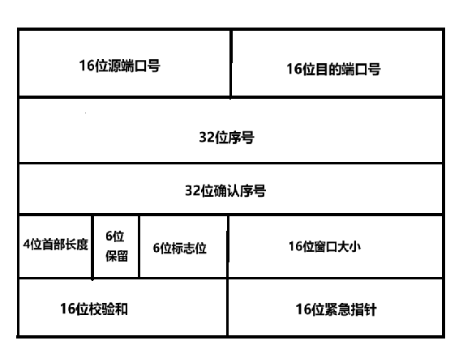

# TCP

——本文参考 游双《Linux高性能服务器编程》

本篇文章要点：

- TCP报文
- TCP状态
- TCP的一系列机制
- 滑动窗口
- 面向字节流

今天我们来谈一谈`TCP`，即`传输控制协议`（Transmission Control Protocol）。总体来说，它是一个具有可靠性，面向连接的、面向字节流的一个__传输层协议__，传输层还有另一个协议——`UDP协议`，这个我们下一篇文章再详谈。


## TCP报文

我们先来看看`TCP协议`的报文部分，其包含了控制书籍传输的多个字段，提供了数据传输、控制过程中的重要信息，下面我们一一来看其内部结构：

### 报头

`TCP协议`的前20字段被称为`TCP报头`，这部分包含了`16位源端口号`，`16位目的端口号`，`32位序号`，`32位确认序号`，`4位首部长度`（6位保留，猜测用于内存对齐），`6位标志位`，`16位窗口大小`，`16位校验和`，`16位紧急指针`，下面分别解释一下：




- __16位源 / 目的端口号__：表示数据从哪个进程端口来，目的是哪个进程端口；
- __32位序号 / 32位确认序号__：可以认为是用于标明报文顺序，实现TCP协议的顺序性的信息，之后会进行详述；
- __4位首部长度：单位是4字节**，表示TCP报文长度，范围[0, 15]，表示的大小为[0, 60]，但是由于__报头的固定长度__，所以其__范围为[20, 60]；
- **6位标志位**：
  - **URG (Urgent)**
    - 功能：**指示紧急数据有效**
    - 作用：当URG标志被设置为1时，**紧急指针字段（Urgent Pointer）将指向紧急数据的结束位置**。接收方在接收该数据时**应优先处理这些数据**
  - **ACK (Acknowledgment)**
    - 功能：**指示确认号字段有效**
    - 作用：当ACK标志被设置为1时，确认号字段包含接收到的下一个字节的序号。**此标志通常在TCP数据传输过程中始终被设置为1**。
  - **PSH (Push)**
    - 功能：**请求接收方尽快将数据传递给应用层**。
    - 作用：当**PSH标志被设置为1**时，接收方**应立即将接收到的数据传递给应用程序**，而不是等待缓冲区满。
  - **RST (Reset)**
    - 功能：**重置连接**。
    - 作用：当**RST标志被设置为1**时，表示**连接出现错误或需要强制关闭**。**接收方会立即关闭连接，丢弃所有未处理的数据**
  - **SYN (Synchronize)**
    - 功能：**请求建立连接**。
    - 作用：在建立TCP连接的过程中，**SYN标志用于初始化序号**。当一方希望建立连接时，会发送带有SYN标志的包。
  - **FIN (Finish)**
    - 功能：**请求关闭连接**。
    - 作用：当**一方希望终止连接时，会发送带有FIN标志的包**，表示发送方已经没有数据要发送。
- __16位窗口大小__：用于反应对端的可接受数据大小
- **16位校验和**：**发送端填充，CRC校验**。接收端校验不通过，则认为数据有问题。此处的检验和不光包含TCP首部，也
  包含TCP数据部分；
- **16位紧急指针**：**表示哪些数据是紧急数据**，**指针指向紧急数据的起始位置**；

综上，我们便简单的介绍了TCP报文中的报头部分，可以看到，这20字节维护了一些非常重要的数据，这也是TCP可以实现可靠性等特点的前提；

### 选项

在报头之后，还有0到40字节的选项，这是TCP可选的字段，关于选项的详细信息我会在之后的文章中详谈，这里就不作解释了。


## TCP状态

TCP在建立连接和断开连接时，会在报头的不同标志位设置对应属性，而且通信两端的TCP状态也会随之发生变化，下面我来介绍一下：

### TCP的三次握手

我们先来谈谈TCP的建立过程，而根据它的特性被总结为TCP的**三次握手机制**：

- **具体行为**

    > 1. 首先客户端发起连接请求（注意，一定是客户端发起的连接请求），根据上面的标志位，可以查到当前标志位应该被设置为SYN，向服务端发起请求；
    > 2. 服务端接收到连接请求（注意，在此之前，服务端一直处于LINSTEN状态，这表示一种监听状态，一旦有连接请求，服务端会立即执行对应操作），先对请求进行确认，随后会向客户也发送一个连接请求（注意，这里为了节省报文发送的数量，采取了捎带应答（后面会谈到），将ACK和SYN并作一起发送给客户端）；
    > 3. 客户端在接收到了对应的连接请求后，也向服务端发送ACK确认报文，至此，TCP建立连接的三次握手完成；

- **状态变化**

  > 1. 首先`Client`发送**SYN连接请求**，进入**SYN_SENT状态**；
  > 2. `Server`接收到连接请求，向`Client`同样发送**SYN连接请求**，同时**捎带ACK确认报文**（称为**捎带应答**），从**LISTEN**状态转变为**SYN_RCVD**状态；
  > 3. `Client`接收到`Server`的确认报文后，从**SYN_SENT**状态转变为**ESTABLISHED**状态，说明`Client`的**TCP连接已经建立完成**，并向`Server`发送**ACK确认报文**；
  > 4. `Server`接收到**ACK**后，从**SYN_RECD**状态转变为**ESTABLISHED**状态；
  >
  >
  >
  > 自此，TCP的**三次握手完成**，**TCP连接正式建立**；

以图片的形式呈现如下：（注意客户端和服务端的状态变化，以及标志位的设置）


### TCP的四次挥手

TCP断开连接的方式和建立类似，不过采用的是**四次挥手（两次请求，两次确认**）的机制：

- **具体行为**

  > 1. 首先，一方（这里是客户端还是服务端没有严格要求）**发起断开请求（对应标志位为FIN）**；
  >
  > 2. 当另一方接收到请求报文时，会**向对端发送一个确认报文（ACK）**；
  >
  > 3. 这时，接收到报文的一方也会**向其对端发送断开请求（同样是FIN**）；
  >
  > 4. 另一方**接收报文并返回确认报文（ACK）**
  >
  >    
  >
  > 至此，**TCP四次挥手过程完成**，**TCP连接断开**

- **状态变化**（这里假设是`Client`向`Server`先发起断开请求）

  > 1. `Client`发送**FIN请求**，请求断开连接，从**ESTABLISHED**状态转为**FIN_WAIT1**状态；
  >
  > 2. `Server`接收到**FIN请求**，状态变为**CLOSE_WAIT**，随后向`Client`发送**ACK确认报文**
  >
  > 3. `Client`接收到**ACK确认报文**，从**FIN_WAIT1**状态变为**FIN_WAIT2**状态
  >
  > 4. 随后由`Server`向`Client`发送**FIN请求**，状态转为**LAST_ACK**
  >
  > 5. `Client`接收到对应请求，注意此时`Client`端将保持当前状态，随后向`Server`发送**ACK确认报文**，进入**TIME_WAIT**状态
  >
  > 6. `Server`在接收到**ACK确认报文**后，进入**CLOSED**状态，此时`Server`的**TCP连接关闭**，**释放连接资源**
  >
  > 7. 在发送**ACK确认报文**后，`Client`会进入`2MSL` 等待状态
  >
  >    （**MSL: Maximum Segment Lifetime，报文最大生存时间**）
  >
  >    > 为什么需要经历`2MSL`的等待时间？
  >    >
  >    > - 确保发送的最后一个ACK能够到达服务器。如果这个ACK丢失，服务器会因为没收到ACK而重传FIN，客户端在 `TIME_WAIT` 状态下可以重新发送ACK。
  >    >
  >    > - 防止“已失效的连接请求报文段”出现在本连接中。等待2MSL可以确保本次连接中产生的所有报文段都从网络中消失。
  >
  > 至此，双方都完成了TCP连接的关闭，正式断开

如下图（这里以客户端先发起为例）：


## TCP的机制

### 确认应答机制（ACK）

TCP会对每个字节的数据进行编号，称为**序列号**，而ACK的确认序号，就是传入数据序列化 + 1，表示在这一序列号前的所有数据已被正确接收，这一机制对后续的超时重传和拥塞控制的实现都极为重要；

### 超时重传机制

> 在网络传输场景中，网络拥塞较为常见，由此带来的数据长时间无法到达对应目标主机的问题就被称为超时问题；
>
> 如果主机A长时间未收到来自目标主机的ACK确认报文，就会触发超时重传机制：即主机A再次向目标主机B发送同一报文；

那上面说的确认应答机制里的序列号有什么作用呢？其实，导致超时问题不仅仅因为网络拥塞，如果ACK报文在传输过程中丢失了，可会触发超时重传机制，但是此时目标主机B已经接收到了数据报文，而A主机会因为超时重传向B主机发送重复报文，影响传输效率；

这时，序列号的作用就体现出来了：如果序列号和确认序号匹配（确认序号大于传过来的序列号），就可以确定该报文是重复报文，从而将其丢弃；

下面，我们再来讨论一下超时时间的确定：

> 理想状态下，找到一个最小时间，满足在该时间之前，确认应答一定会返回并被接收；
>
> 但是，这个时间会随着网络状况的不同而变化；
>
> 如果时间设定太长，会影响重传的效率；而如果时间设定太短，则有可能导致不必要的数据重传，影响传输效率；

所以，为了适配网络传输环境的变化，TCP会动态计算这个最大超时重传时间，以保证传输效率的最大化；

>Linux（BSD Unix 和 Windows 一样）中，超时以500ms为一个单位进行控制，即每次传输的控制时间都是500ms的整数倍；
>
>如果重发一次后，仍然未收到确认应答，等待2 * 500ms后再进行重传；
>
>如果还未收到，则等待4 * 500ms再进行重传，以此类推，以指数形式递增；
>
>累计到一定的重传次数，TCP会认为网络或对端主机出现异常，强制关闭连接；

### 连接管理机制

连接管理机制即为TCP连接时的三次握手和四次挥手，图解可看上文的介绍，这里只谈一下它们的状态变化：
_三次握手_

**服务端**：首先是服务端启动，处于LISTEN状态，监听来自其他主机的连接请求，在接收到一个请求后，转为SYN_RCVD状态，并向目标主机发送SYN + ACK报文，用于确认并建立连接，当收到对端传来的ACK确认报文后，变为ESTABLISHED状态，至此服务端连接建立完成；

**客户端**：首先客户端先向服务端发送SYN连接请求，此时处于SYN_SENT状态，当接收到对端确认报文后，客户端连接至此建立完成，状态更新为ESTABLISHED状态；

根据上面的描述，可以发现客户端先于服务端建立起TCP连接，且一定是客户端先发起连接请求；


__四次挥手__与三次握手不同，其没有严格的次序要求，即客户端或服务端均可以发起断开连接请求（这里以客户端先发起请求为例）：

_四次挥手_

**客户端**：首先客户端向服务器发送FIN断开连接请求，此时状态更新为FIN_WAIT_1，在接收到服务端的确认报文后，状态更新为FIN_WAIT_2，之后还会接收到服务端的FIN断开请求，此时状态更新为TIME_WAIT，并向服务端发送最后一个确认报文，至此四次挥手完成，TCP连接完全断开；

**服务端**：服务端被动接收到客户端传来的FIN请求，状态更新为CLOSE_WAIT状态（被动关闭），并向客户端发送确认报文，随后服务端向客户端发送FIN请求，状态更新为LAST_ACK，等到接收到客户端传来的ACK确认报文后，状态更新为CLOSED，至此服务端的TPC连接完全断开，四次挥手完成；


#### 详解TIME_WAIT状态

注意，在客户端接收到服务端的FIN报文后，并没有立即退出，而是处于TIME_WAIT并持续一段时间（**2 * MSL**，**MSL**, _Maximum Segment Life_，**报文段最大生存时间**），才能完全关闭，MSL是TCP报文在网络中的最大生存时间（标准文档RFC 1122的建议是2min）；

下面来说明TIME_WAIT状态存在的意义：

>1. 可靠的终止TCP终止连接；
>2. 保证未及时到达终端的TCP报文段有足够的时间被识别并丢弃；

对于第一点：如果报文段7丢失，会触发超时重传机制，如果客户端过早的退出，服务端向客户端重传FIN请求，而客户端会以复位段报文处理该请求，而对服务器来说会导致错误；

对于第二点：当客户端过早退出时，一些还未及时传送到客户端的数据会停留在通信管道中，等待清理，此时如果立即在同一个客户端端口向服务端发起连接请求（需要强制绑定对应端口，因为客户端采用的是随机端口号，如果不想强制绑定端口号，可以由服务端首先向客户端发送FIN...），会导致上次残留数据向当前客户端传送（即“迟到的报文”），这显然是不合理的，所以要求具有一定的缓冲时间，用于清除通信管道中的残留数据；

最后在再解释一下为什么是2 _MSL——因为MSL表示TLC报文段在网络中的最大生存时间，所以使用2* MSL将保证任何报文传送在该时间段内必然会完成，且那些未及时传送到对端的数据会被_中转路由器_完全丢弃，从而避免上述问题；


#### 如何解决因TIME_WAIT状态导致的端口不可用

这里介绍一个方法——socket 复用：

在建立socket的函数调用中，可以采用复用机制避免因端口不可用问题——其本质就是允许多个进程绑定同一个端口号，具体实现如下：

```C
int opt = 1;
setsockopt(socket_fd, SOL_SOCKET, SO_REUSEADDR, &opt, sizeof(opt));
```

